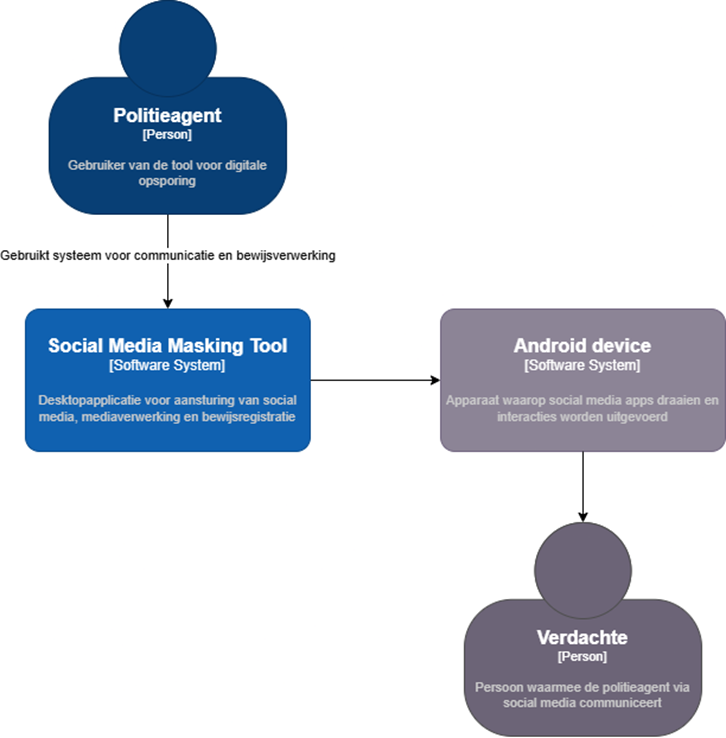
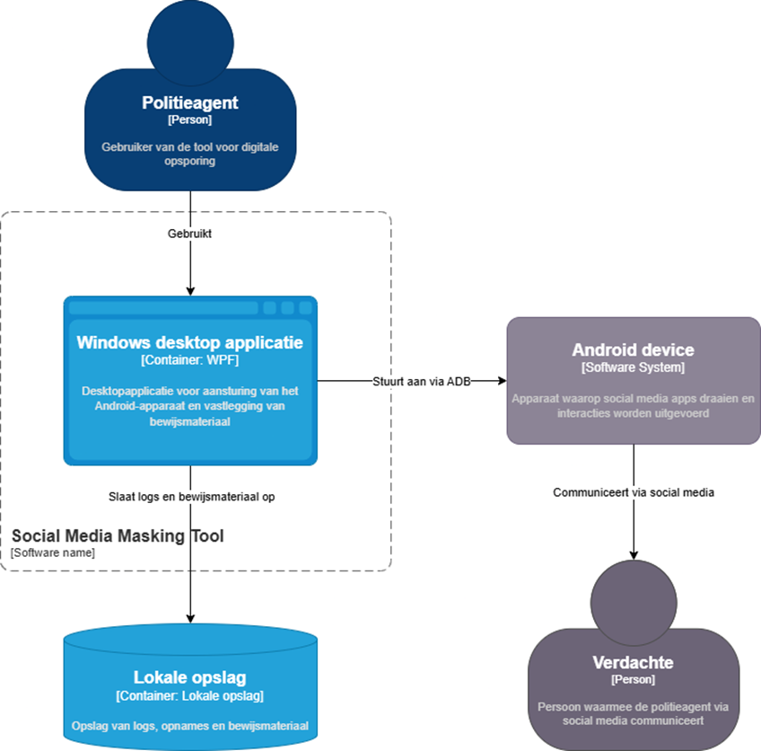
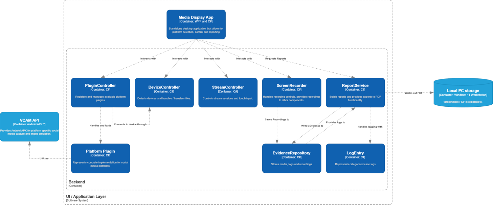

# Social Media Masking Tool

The Social Media Masking Tool is an application that aims to reduce the
complexity of conducting realistic social media interactions within police investigations.

The application solves this by presenting communication and media as if
they came from a mobile social media app. 
Currently, only Snapchat is supported, but the goal is to expand the tool 
to multiple platforms such as Discord, WhatsApp, and Instagram. 
In addition, a logging system is being developed that automatically 
and unnoticed records the burden of proof for use in files.

## Goal

The underlying goal is to collect as much relevant information as possible with the help of this tool;
 For example, a closer live location, chat history, and media files, which can help identify suspects and strengthen the evidence in investigations.

 This while we deploy the tool as one standalone desktop application that has the capability to be integrated with many social media platforms.

## C4 Model Design

### C1 Context Diagram

### C2 Container Diagram

### C3 Component Diagram

## Installation

Installation instructions can be found in the [Installation Guide](./docs/Installation.md).

## Project Architecture

A detailed explanation of the project architecture, solution structure, layers, and project references can be found in the [Project Architecture](./docs/project-architecture.md).